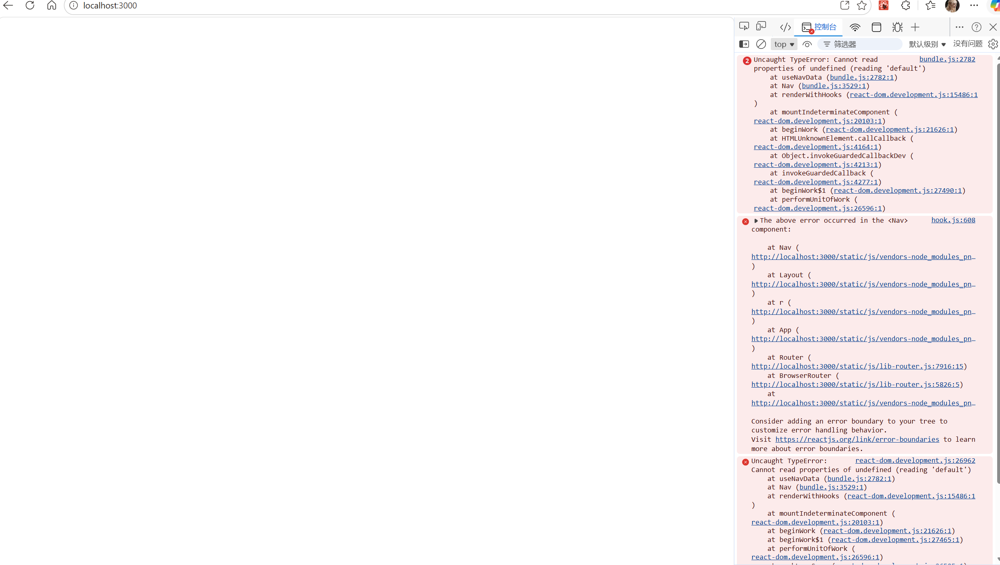
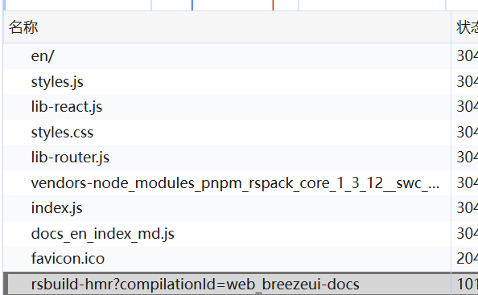
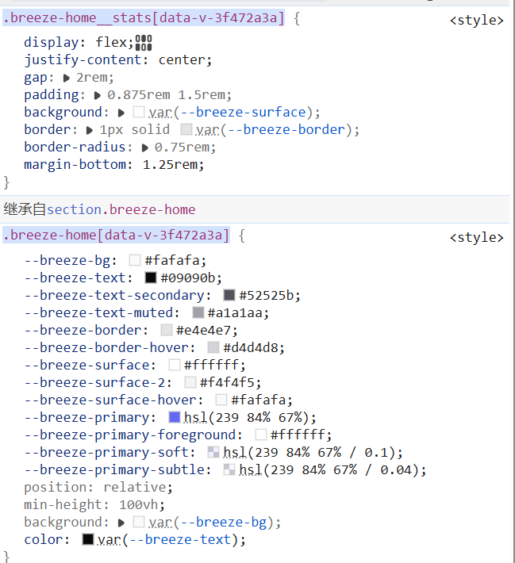
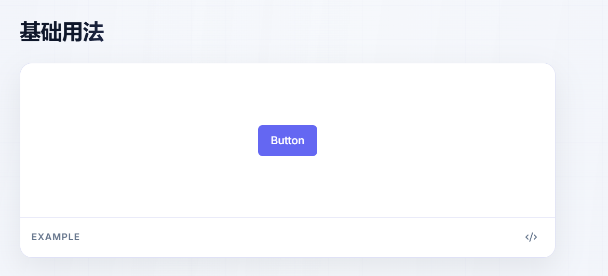

<div align="center">


# BreezeDock

### Your thoughts deserve a quiet, secure place to land.

A lightweight, privacy-first desktop note-taking app with floating notes, built with Tauri v2 + React.

---

[](https://tauri.app/)
[](https://react.dev/)
[](https://www.typescriptlang.org/)
[](https://www.rust-lang.org/)
[](LICENSE)

[Features](#-features) · [Screenshots](#-screenshots) · [Tech Stack](#-tech-stack) · [Getting Started](#-getting-started) · [Architecture](#-architecture)

</div>

---

## Why BreezeDock?

> Most note apps want your cloud account, your sync subscription, and your data.
> BreezeDock doesn't. Everything stays on your machine — encrypted, fast, and offline.

| | BreezeDock | Notion | Obsidian | Sticky Notes |
|---|:---:|:---:|:---:|:---:|
| 100% Local, No Cloud | ✅ | ❌ | ✅ | ✅ |
| AES-256 Encryption | ✅ | ❌ | Plugin | ❌ |
| Floating Desktop Notes | ✅ | ❌ | Plugin | ✅ |
| Click-Through Mode | ✅ | ❌ | ❌ | ❌ |
| Incognito Mode | ✅ | ❌ | ❌ | ❌ |
| Anti-Screenshot | ✅ | ❌ | ❌ | ❌ |
| Version History | ✅ | ✅ | Plugin | ❌ |
| Tiny Binary (~5MB) | ✅ | N/A | ❌ | N/A |

---

## ✨ Features

### 📝 Note-Taking Core

- **Rich Text Editor** — ContentEditable-based WYSIWYG editor with a full toolbar
  - Headings (H1–H3), **bold**, *italic*, ~~strikethrough~~
  - Ordered / unordered / task lists
  - Code blocks with syntax highlighting (highlight.js)
  - Auto-link detection and smart URL handling
- **Auto Save** — Debounced (500ms) auto-save with every edit, plus full **version history** with diff view and one-click rollback
- **Note Templates** — Built-in templates: Blank, Todo List, Meeting Notes, Snippet, Idea
- **Pin & Star** — Pin important notes to the top, star favorites for quick access

### 🔍 Search & Organization

- **Fuzzy Search** — Powered by [Fuse.js](https://fusejs.io/) with weighted field matching and real-time keyword highlighting
- **Multi-Level Groups** — Nested folder hierarchy with drag-and-drop reordering (`@dnd-kit`)
- **Color-Coded Tags** — Create tags with custom colors, filter notes by tag, manage note-tag associations
- **Smart Filters** — Quick-filter by: All / Starred / Archived / Trash / By Group / By Tag

### 🪟 Floating Notes (Desktop Widgets)

- **Pop-Out Any Note** — Transform any note into a free-floating, always-on-top desktop widget
- **Click-Through Mode** — Toggle mouse penetration so the floating note becomes transparent to clicks
- **Opacity Slider** — Adjust window transparency from 0% to 100%
- **Window Position Memory** — Float positions, sizes, and states are persisted in SQLite
- **Edge Docking** — Snap floating notes to screen edges and auto-collapse
- **Per-Note Security** — Individual lock, password protection, and security levels for each floating note

### 🔒 Security & Privacy

- **AES-256-GCM Encryption** — Notes encrypted at rest using Argon2 key derivation; key only lives in memory while unlocked
- **App Lock Screen** — Password-protect the entire application; required on every launch
- **Incognito Mode** — Create notes that exist **only in RAM** — never touch the database, destroyed on close
- **Anti-Screenshot** — OS-level protection to prevent screen capture of sensitive windows
- **Debugger Detection** — Built-in anti-debugging measures for tamper resistance
- **Encrypted Backups** — Export and import backups with full AES encryption

### 🎨 User Experience

- **Light / Dark / System Theme** — Three theme modes with SoybeanUI color palette and smooth transitions
- **Custom Frameless Window** — No default title bar; hand-crafted drag region with native resize support
- **Global Keyboard Shortcuts** — Show/hide main window, quick-capture, and more from any app
- **System Tray Integration** — Minimize to tray, quick actions, always running in the background
- **Auto-Start on Boot** — Optionally launch automatically when you log in
- **Context Menus** — Rich right-click menus on notes, groups, and tags
- **Clipboard Integration** — Read/write/clear clipboard directly from notes
- **Close Confirmation** — Accidental close protection with a confirmation dialog
- **Recycle Bin** — Soft-delete notes with restore capability and "empty trash" action

---

## 📸 Screenshots

<table>
  <tr>
    <td align="center" width="50%">
      
      <br/><b>Main Interface</b>
      <br/><sub>Clean sidebar + note list + editor</sub>
    </td>
    <td align="center" width="50%">
      
      <br/><b>Dark Theme</b>
      <br/><sub>Seamless dark mode with SoybeanUI colors</sub>
    </td>
  </tr>
  <tr>
    <td align="center">
      
      <br/><b>Floating Notes</b>
      <br/><sub>Desktop widgets with opacity & click-through</sub>
    </td>
    <td align="center">
      
      <br/><b>Rich Text Editor</b>
      <br/><sub>Toolbar, code blocks, task lists</sub>
    </td>
  </tr>
</table>

---

## 🛠 Tech Stack

<table>
  <tr>
    <th>Layer</th>
    <th>Technology</th>
    <th>Purpose</th>
  </tr>
  <tr>
    <td>🖥️ Frontend</td>
    <td><b>React 18</b> + TypeScript 5</td>
    <td>Component-based UI with full type safety</td>
  </tr>
  <tr>
    <td>🎨 Styling</td>
    <td><b>Tailwind CSS 3</b> + shadcn/ui</td>
    <td>Utility-first CSS with accessible component primitives (Radix UI)</td>
  </tr>
  <tr>
    <td>📦 State</td>
    <td><b>Zustand</b> 4</td>
    <td>Lightweight, modular global state (5 stores)</td>
  </tr>
  <tr>
    <td>🧭 Routing</td>
    <td><b>React Router</b> v6</td>
    <td>Nested routes with auth guards</td>
  </tr>
  <tr>
    <td>🔍 Search</td>
    <td><b>Fuse.js</b> 6</td>
    <td>Client-side fuzzy search with configurable thresholds</td>
  </tr>
  <tr>
    <td>🖱️ Drag & Drop</td>
    <td><b>@dnd-kit</b></td>
    <td>Accessible, performant sortable lists</td>
  </tr>
  <tr>
    <td>⚙️ Backend</td>
    <td><b>Rust</b> (Tauri v2)</td>
    <td>Native desktop runtime with minimal footprint (~5MB)</td>
  </tr>
  <tr>
    <td>🗄️ Database</td>
    <td><b>SQLite</b> (rusqlite + r2d2)</td>
    <td>Local persistence with connection pooling (WAL mode)</td>
  </tr>
  <tr>
    <td>🔐 Encryption</td>
    <td><b>AES-256-GCM</b> + Argon2</td>
    <td>Military-grade data-at-rest encryption & key derivation</td>
  </tr>
  <tr>
    <td>⚡ Build</td>
    <td><b>Vite</b> 5</td>
    <td>Sub-second HMR & optimized production builds</td>
  </tr>
</table>

---

## 🏗 Architecture

```
BreezeDock/
├── 📁 src/                                # ⚛️ Frontend (React + TypeScript)
│   ├── 📁 components/
│   │   ├── 📁 ui/                         # 🧱 Atomic UI (shadcn/ui + Br prefix)
│   │   │   ├── button.tsx, card.tsx, dialog.tsx, input.tsx
│   │   │   ├── select.tsx, slider.tsx, switch.tsx, tooltip.tsx
│   │   │   ├── command.tsx, combobox.tsx, context-menu.tsx
│   │   │   ├── dropdown-menu.tsx, hover-card.tsx, popover.tsx
│   │   │   ├── note-card.tsx, group-item.tsx, group-tree.tsx
│   │   │   ├── tag.tsx, tag-input.tsx, badge.tsx, color-picker.tsx
│   │   │   └── ...
│   │   ├── 📁 layout/                     # 🏠 App skeleton
│   │   │   ├── BrAppShell.tsx             #   Theme injection & CSS init
│   │   │   ├── BrWindowFrame.tsx          #   Frameless window container
│   │   │   ├── BrTitleBar.tsx             #   Custom drag region + window controls
│   │   │   ├── BrSidebar.tsx              #   Groups, navigation, quick actions
│   │   │   └── BrMainLayout.tsx           #   Note list + editor split pane
│   │   ├── 📁 dnd/                        # 🖱️ Drag-and-drop
│   │   └── 📁 theme/                      # 🌗 ThemeProvider
│   │
│   ├── 📁 features/                       # 🎯 Business modules
│   │   ├── 📁 editor/                     #   Rich editor, toolbar, code blocks
│   │   ├── 📁 search/                     #   Fuzzy search bar + result list
│   │   ├── 📁 floating/                   #   Floating note cards & window manager
│   │   ├── 📁 security/                   #   Lock screen & security settings
│   │   ├── 📁 settings/                   #   App settings page
│   │   ├── 📁 history/                    #   Version history, diff, timeline
│   │   ├── 📁 backup/                     #   Data import/export
│   │   ├── 📁 trash/                      #   Recycle bin
│   │   ├── 📁 notes/                      #   Note list, filters, toolbar
│   │   └── 📁 templates/                  #   Note template selector
│   │
│   ├── 📁 stores/                         # 📦 Zustand (5 stores)
│   │   ├── useNoteStore.ts                #   Notes CRUD, search, history
│   │   ├── useGroupStore.ts               #   Groups tree + sort
│   │   ├── useTagStore.ts                 #   Tags CRUD + association
│   │   ├── useSettingStore.ts             #   Settings (localStorage-persisted)
│   │   └── useUIStore.ts                  #   Sidebar, search, modals, toasts
│   │
│   ├── 📁 hooks/                          # 🪝 Custom hooks
│   │   ├── useAutoSave.ts                 #   Debounced auto-save
│   │   ├── useGlobalShortcuts.ts          #   Global hotkeys
│   │   ├── useFloatingWindow.ts           #   Floating note lifecycle
│   │   ├── useContextMenu.ts              #   Right-click menus
│   │   ├── useKeyboard.ts                 #   Keyboard shortcuts
│   │   └── useDebounce.ts, useTheme.ts
│   │
│   ├── 📁 utils/                          # 🔧 Utilities
│   │   ├── search.ts                      #   Fuse.js wrapper
│   │   ├── clipboard.ts                   #   Clipboard operations
│   │   ├── format.ts                      #   Date & word count
│   │   └── index.ts
│   │
│   └── 📁 types/                          # 📐 TypeScript interfaces
│       └── index.ts                       #   Note, Group, Tag, Settings, etc.
│
├── 📁 src-tauri/                          # 🦀 Backend (Rust)
│   └── 📁 src/
│       ├── 📁 commands/                   # 📡 Tauri IPC layer (80+ commands)
│       │   ├── notes.rs                   #   16 note commands
│       │   ├── groups.rs                  #   10 group commands
│       │   ├── tags.rs                    #   11 tag commands
│       │   ├── settings.rs                #   6 settings commands
│       │   ├── window.rs                  #   30+ window & floating commands
│       │   ├── security.rs                #   11 security commands
│       │   ├── backup.rs                  #   6 backup commands (plain + encrypted)
│       │   ├── clipboard.rs               #   3 clipboard commands
│       │   └── shortcuts.rs               #   3 shortcut commands
│       │
│       ├── 📁 db/                         # 🗄️ SQLite data layer
│       │   ├── schema.rs                  #   DDL (7 tables + indexes)
│       │   ├── notes.rs, groups.rs, tags.rs
│       │   ├── floating.rs, crypto.rs
│       │   └── mod.rs                     #   r2d2 connection pool
│       │
│       ├── 📁 crypto/                     # 🔐 Encryption
│       │   └── aes.rs                     #   AES-256-GCM encrypt/decrypt
│       │
│       ├── 📁 window/                     # 🪟 Multi-window manager
│       │   ├── floating.rs                #   Floating note windows + Win32 APIs
│       │   ├── security.rs                #   Screen capture prevention
│       │   └── mod.rs
│       │
│       ├── 📁 fs/                         # 📂 File operations
│       │   └── backup.rs                  #   JSON serialization & file I/O
│       │
│       ├── 📁 tray/                       # 🔔 System tray
│       │   ├── icon.rs                    #   Tray icon generation
│       │   └── mod.rs                     #   Tray menu & event handler
│       │
│       ├── lib.rs                         # 🚀 App entry & 80+ command registration
│       └── main.rs                        #   Rust main → lib::run()
│
├── 📁 docs/                               # 📖 Architecture docs
├── 📁 demo/                               # 📸 Screenshots
└── 📁 public/                             # 🌐 Static assets (fonts)
```

### Data Flow

```
┌──────────────────────────────────────────────────────┐
│                    React Frontend                     │
│  ┌─────────┐  ┌──────────┐  ┌────────────────────┐  │
│  │ Zustand  │←→│ React    │←→│ Tauri invoke()     │  │
│  │ Stores   │  │Components│  │ (IPC Bridge)       │  │
│  └─────────┘  └──────────┘  └────────┬───────────┘  │
└──────────────────────────────────────┼───────────────┘
                                       │ Tauri IPC
┌──────────────────────────────────────┼───────────────┐
│                    Rust Backend      │               │
│  ┌───────────────────────────────────▼─────────────┐ │
│  │              Tauri Commands (80+)                │ │
│  │  ┌────────────┐ ┌──────────┐ ┌──────────────┐  │ │
│  │  │ Validation │→│ Business │→│ SQLite + AES │  │ │
│  │  │ & Parsing  │ │  Logic   │ │   Storage    │  │ │
│  │  └────────────┘ └──────────┘ └──────────────┘  │ │
│  └─────────────────────────────────────────────────┘ │
└──────────────────────────────────────────────────────┘
```

---

## 🚀 Getting Started

### Prerequisites

| Tool | Version | Install |
|------|---------|---------|
| Node.js | >= 18 | [nodejs.org](https://nodejs.org/) |
| pnpm | >= 8 | `npm install -g pnpm` |
| Rust | >= 1.70 | [rustup.rs](https://rustup.rs/) |
| Tauri CLI | v2 | [Prerequisites Guide](https://v2.tauri.app/start/prerequisites/) |

### Development

```bash
# 1. Clone the repository
git clone https://github.com/BL0818/breeze-dock.git
cd breeze-dock

# 2. Install frontend dependencies
pnpm install

# 3. Start development server (hot reload for both frontend & Rust)
pnpm tauri:dev
```

The app will open automatically with hot module replacement for the frontend and automatic recompilation for Rust changes.

### Production Build

```bash
# Build optimized installer
pnpm tauri:build
```

Output: `src-tauri/target/release/bundle/nsis/` (Windows NSIS installer)

### Available Scripts

| Script | Description |
|--------|-------------|
| `pnpm dev` | Start Vite dev server (frontend only) |
| `pnpm build` | Build frontend (TypeScript check + Vite) |
| `pnpm tauri:dev` | Start full Tauri dev environment |
| `pnpm tauri:build` | Build production installer |
| `pnpm type-check` | Run TypeScript type checking |
| `pnpm lint` | Run ESLint with auto-fix |

---

## 🗄️ Database Schema

BreezeDock uses **SQLite** in WAL mode with 7 tables:

| Table | Purpose |
|-------|---------|
| `notes` | Note content, metadata, flags (pin/star/archive/trash) |
| `note_tags` | Many-to-many note ↔ tag association |
| `tags` | Color-coded tags |
| `groups` | Nested folder hierarchy (self-referencing `parent_id`) |
| `note_history` | Version snapshots for rollback |
| `settings` | Key-value app configuration |
| `floating_configs` | Floating window positions, sizes, and states |

All tables use UUID v4 primary keys with proper foreign key constraints and optimized indexes.

---

## ⌨️ Keyboard Shortcuts

| Shortcut | Action |
|----------|--------|
| `Ctrl + N` | New note |
| `Ctrl + F` | Focus search |
| `Ctrl + S` | Force save current note |
| `Ctrl + ,` | Open settings |
| `Ctrl + W` | Close current note |
| `Ctrl + Shift + N` | New floating note |
| `Ctrl + Shift + F` | Toggle floating note |
| `Ctrl + Q` | Quit app |

> Shortcuts are customizable in the settings page.

---

## 🤝 Contributing

Contributions are welcome! Here's how you can help:

1. 🍴 **Fork** the repository
2. 🌿 **Create** a feature branch: `git checkout -b feature/amazing-feature`
3. 💾 **Commit** your changes: `git commit -m 'Add amazing feature'`
4. 📤 **Push** to the branch: `git push origin feature/amazing-feature`
5. 🎉 **Open** a Pull Request

### Development Guidelines

- All React components use the `Br` prefix (e.g., `BrNoteCard`, `BrSidebar`)
- Styling uses Tailwind CSS utility classes only — no custom CSS files
- Rust ↔ TypeScript data transfer requires explicit type definitions on both sides
- Sensitive data must be encrypted via AES before database writes

---

## 📄 License

This project is licensed under the **MIT License** — see the [LICENSE](LICENSE) file for details.

<div align="center">

---

**Built with ❤️ using Tauri, React, and Rust**

[⬆ Back to Top](#breezedock)

</div>
